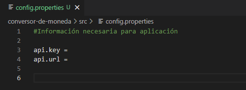
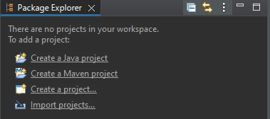
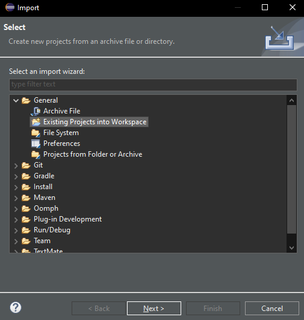
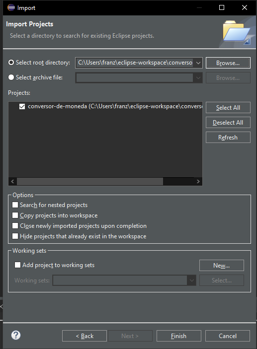
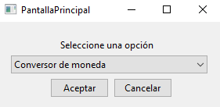
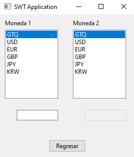
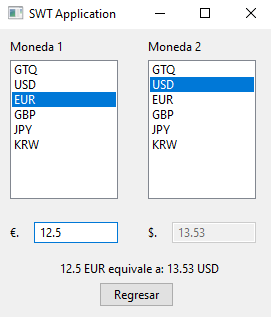

# INTRODUCCIÓN

Este programa realiza la conversión de las siguientes monedas: GTQ, USD, EUR, GBP, JPY y KRW, entre ellas. También tiene la opción de realizar conversión de temperatura en las siguientes unidades: °C, °F, K, R.

# USO
## INSTRUCCIONES ANTES DE USO

En la carpeta principal del proyecto, en la ruta \src se encuentra un archivo llamado config.properties. Este documento se debe llenar con el API key de conveniencia de la página de conversión de moneda de preferencia. En este caso se hizo uso de ExchangeRate-API, después de crear una cuenta se podrá tener acceso a un API key que se debe introducir en la línea 3 y el URL de la página en la línea 4.

La modificación se puede realizar en cualquier editor de texto o en un IDE.

Tomar nota que la aplicación se realizó con la V4 del API.

## IMPORTACIÓN DEL PROYECTO

Para la importación del proyecto se estará utilizando, en este caso, Eclipse. El primer paso consiste en seleccionar la opción de importar proyecto, al seleccionar esta opción se deberá seleccionar la opción para importar proyectos existentes. Luego, se deberá seleccionar la carpeta donde se encuentra el proyecto y, finalmente, presionar el botón de finalizar.

## PANTALLA PRINCIPAL

En la pantalla principal se podrá observar una pequeña lista donde se puede seleccionar el conversor, como se mencionó, se tiene el conversor de moneda o temperatura. Luego de seleccionar una de las opciones y presionar el botón "Aceptar" se abrirá la nueva ventana.

Nota: También si se desea cerrar el programa se puede cerrar con el botón de la esquina superior derecha o con el botón "Cancelar".
Nota #2: Las dos ventanas son similares, lo único que cambia es el tipo de conversión a realizar.

## VENTANA DE CONVERSIÓN (MONEDA O TEMPERATURA)

En la ventana de conversión se pueden observar todas las opciones mencionadas en la introducción. El primer paso en esta ventana es seleccionar la moneda 1 del listado (moneda a convertir), luego la moneda 2 del listado (moneda final). Por defecto está seleccionada la primera opción en las dos listas. 

Después de esto, se debe escribir la cantidad a convertir en el espacio que se encuentra debajo de la lista 1, el programa está diseñado para solo recibir números con o sin punto decimal. Luego, se mostrará en el espacio debajo de la lista 2 el valor inicial convertida a la moneda 2 y debajo un texto con una explicación breve de la conversión.

Nota: El botón "Regresar" llevará a la pantalla principal.

# CRÉDITOS

Creado como un challenge para la formación de Oracle Next Education (ONE). Elaborado por Franz Much, 2023.